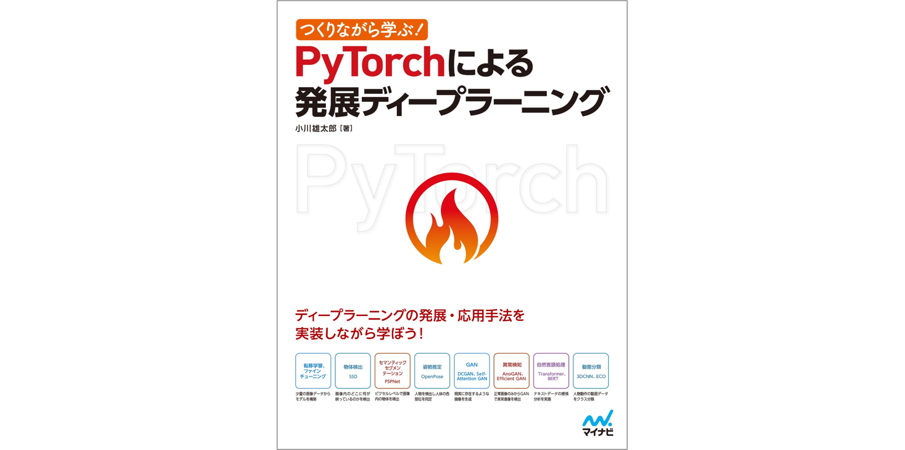

## 만들기하면서 배우기! PyTorch로 발전 딥 러닝

### 1. 이 문서에서 다루는 작업 내용과 딥 러닝 모델

- 제1장 이미지 분류와 전이 학습(VGG)
- 제2장 물체인식(SSD)
- 제3장 시맨틱 세그먼테이션(PSPNet)
- 제4장 자세 추정(OpenPose)
- 제5장 GAN에 의한 이미지 생성(DCGAN, Self-Attention GAN)
- 제6장 GAN에 의한 이상 검지(AnoGAN, Efficient GAN)
- 제7장 자연언어처리에 의한 감정분석(Transformer)
- 제8장 자연언어처리에 의한 감정분석(BERT)
- 제9장 동영상 분류(3DCNN, ECO)

이 설명서의 자세한 내용은 아래에서 별도로 설명합니다.

[「Qiita 기사：PyTorch에 의한 발전 딥 러닝, 각 장의 소개」](https://qiita.com/sugulu/items/07253d12b1fc72e16aba)

 
